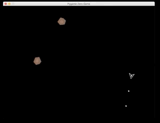

 # PyLondinium 2019 Dojo

An implementation of the arcade classic 
[Asteroids](https://www.youtube.com/watch?v=WYSupJ5r2zo) 
using [PyGame Zero](https://pygame-zero.readthedocs.io/en/stable/index.html).  (Sort of.)



To play:
* Up Key Accelerates
* Left & Right Keys Steer
* Space-Bar Shoots
* There are no brakes.  The ship slowly slows itself, all the time. 

Requirements: 
* pgzero
* numpy 

Running:
```
pgzrun asteroids.py
```

A few caveats:
* This is incomplete in quite a few ways.  (Not bad for an afternoon though.)
* We didn't get around to detecting collisions between the ship and asteroids.  So there's no "Game Over". 
